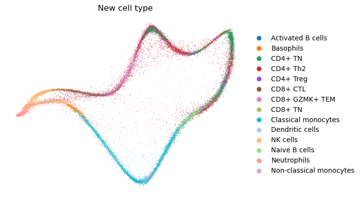
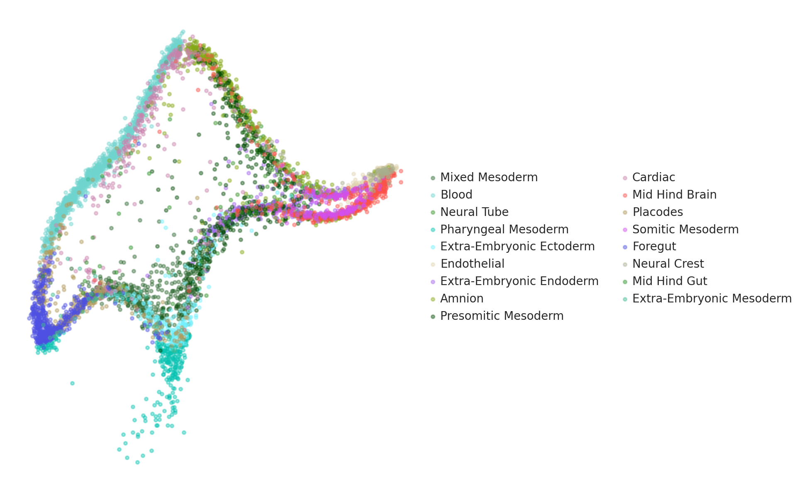

# Picasso — Fork by [@siam](https://github.com/siam)

> This is a fork of [pachterlab/picasso](https://github.com/pachterlab/picasso). See the [original repository](https://github.com/pachterlab/picasso) for core documentation. This fork extends Picasso with a modernized environment, trained model checkpoints, and applied single-cell analysis on NTM (nontuberculous mycobacteria) lung disease data.

---

## What I Added

| Addition | Description |
|---|---|
| `env/conda_env.yaml` | Updated conda environment with Python 3.10 + PyTorch ≥ 2.0 |
| `checkpoints/ckpt.pth` | Saved model checkpoint for resuming training |
| `picasso_v2.ipynb` | Analysis notebook applying Picasso to NTM scRNA-seq data |
| `figures/` | Generated publication-style output figures |
| `cell_type.png` | Picasso embedding colored by cell type (see below) |

---

## Applied Analysis: NTM Lung Disease scRNA-seq

I applied Picasso to single-cell RNA-seq data from NTM (nontuberculous mycobacteria) lung disease samples. Cells are embedded onto elephant-shaped coordinates — the signature Picasso output — and colored by cell type identity.

<p align="center">
  
  <br/>
  <em>Picasso embedding of NTM lung scRNA-seq data, colored by cell type</em>
</p>

Additional figures generated from this analysis:

| Figure | Description |
|---|---|
| `figures/picasso_180flipped_elephantcell_type_simplified_v5.pdf` | Simplified cell type map |
| `figures/picasso_180flipped_elephantNTM_DE_eff_size_v6.pdf` | Differential expression effect sizes |
| `figures/picasso_180flipped_elephantSymptomatic_DA_lfc_v7.pdf` | Symptomatic vs. non-symptomatic log fold change |

---

## Environment Setup (Updated for Python 3.10 + PyTorch 2.0)

The original environment files (Python 3.7) are preserved. I added a modern alternative:

```bash
conda env create -f env/conda_env.yaml
conda activate picasso_env
```

This installs:
- Python 3.10
- PyTorch ≥ 2.0 (with CUDA support)
- NumPy ≥ 1.23, SciPy ≥ 1.10, Pandas ≥ 2.0
- AnnData ≥ 0.9, Matplotlib ≥ 3.7

For the original Python 3.7 environments, see `env/env3.7_LINUX.yml` or `env/env3.7_MACOS.yml`.

---

## Running with a Checkpoint

The `checkpoints/ckpt.pth` file contains a pre-trained model state. To load it:

```python
from Picasso import Picasso

pic = Picasso(adata, mapPoints)
pic.fit(checkpt="checkpoints/ckpt.pth")
```

This resumes training from the saved checkpoint rather than starting from scratch.

---

## Original Picasso

Picasso maps points of an input matrix to user-defined, n-dimensional shape coordinates while minimizing reconstruction error via an autoencoder neural network.

<p align="center">
  
  <br/>
  <em>Original Picasso example — single-cell data embedded onto elephant coordinates</em>
</p>

Examples for running Picasso can be found in [examplePicasso.ipynb](examplePicasso.ipynb). The notebook can be run in Google Colab:

[](https://colab.research.google.com/github/pachterlab/picasso/blob/main/examplePicasso.ipynb)

Elephant coordinates from [Mayer et al. 2010](https://aapt.scitation.org/doi/full/10.1119/1.3254017).

---

## Citation

If you use Picasso, please cite the original authors:

> Pachter Lab. *Picasso*. GitHub. https://github.com/pachterlab/picasso
